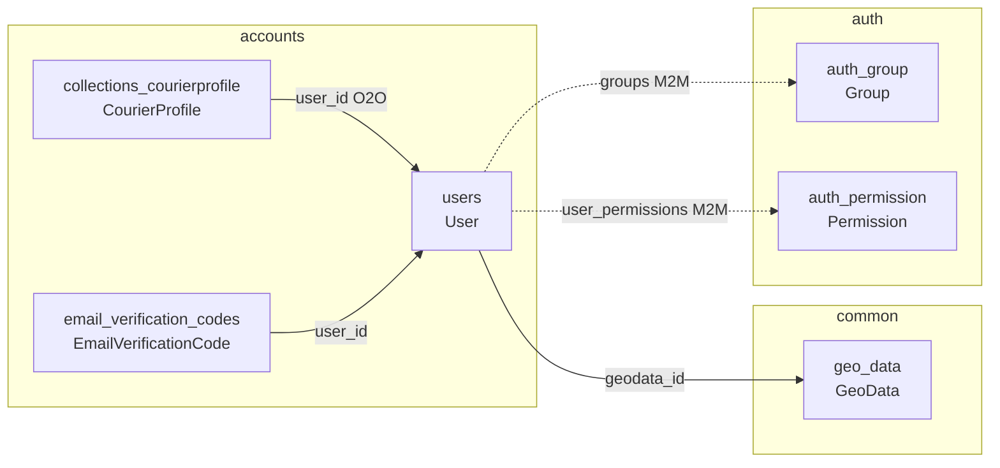
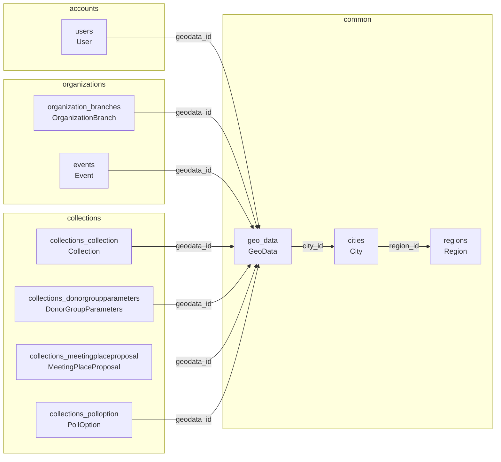
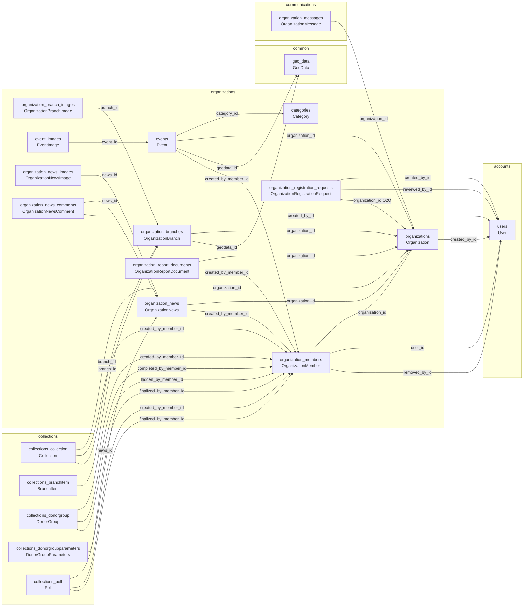
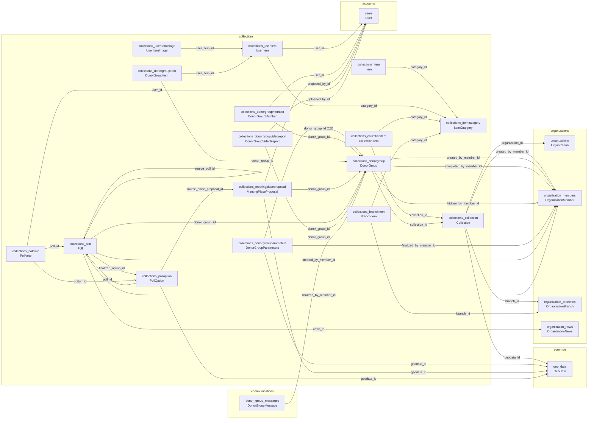
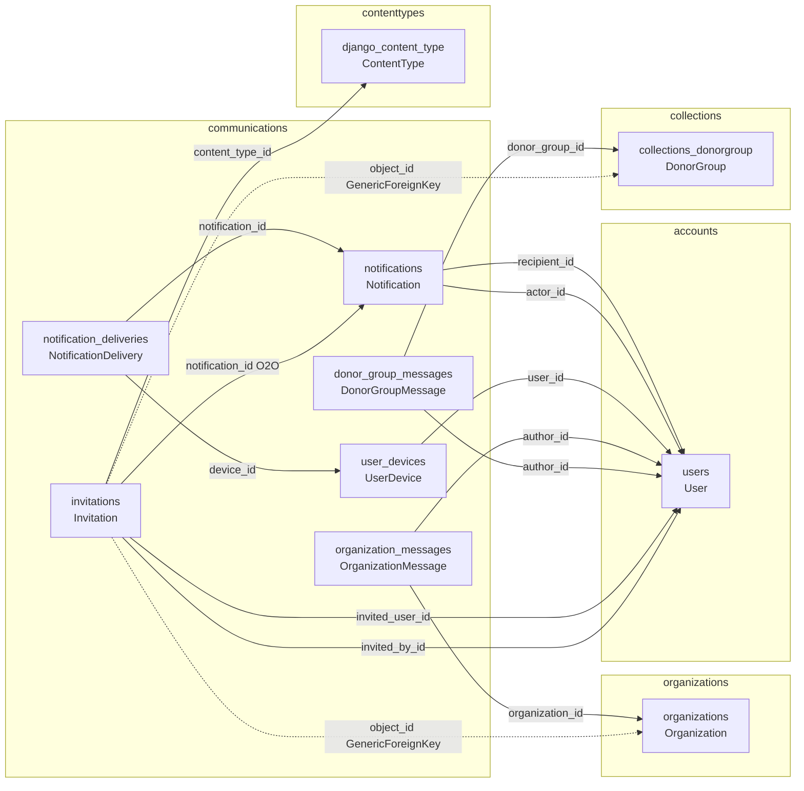

# Backend ER Diagrams By App

Диаграммы построены по текущим Django models. В каждом разделе:

- основной квадрат содержит все таблицы выбранного приложения;
- квадраты других приложений содержат только таблицы, связанные с выбранным приложением;
- стрелка показывает FK/O2O/M2M направление от таблицы-владельца поля к целевой таблице.

## accounts

## common

## organizations

## collections

## communications

